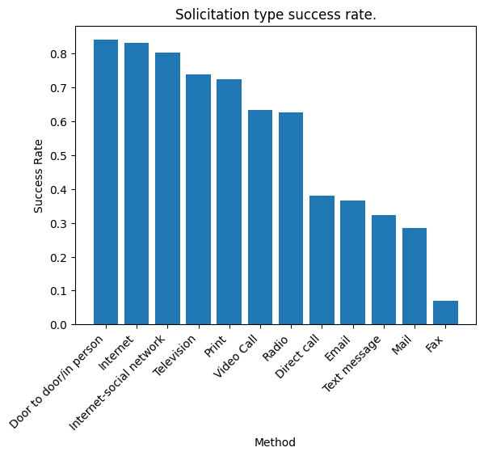
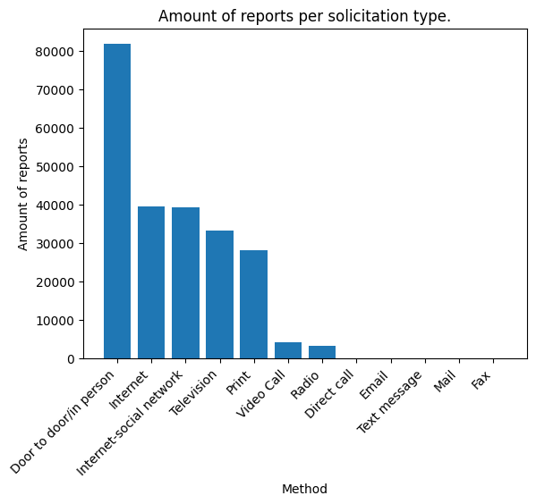
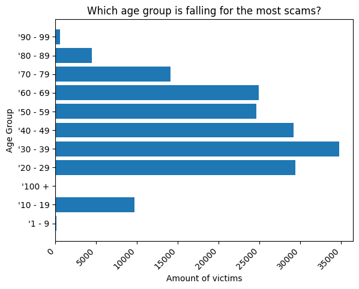

# Canada Fraud Data Analysis

For a final project in another Python class, my team was tasked with performing data analysis on data imported from an open data source. The data source my partner chose came from the Open Government Canada website, via their Open Data Lake.

The dataset chosen from the Open Data Lake was a fraud report dataset.

The initial challenge with the dataset was that it was primarily in french, as the dataset must have originated from a Quebec source into the Open Government Portal. I used AI tools to translate all columns and rows within the dataset to english.

Afterword, I began to create my Python Jupyter notebook to begin my analysis.

# Questions I had for the Dataset:

- Which solicitation method has the highest success rate?
- Which age range fell for the most scams?
- How much money was lost per month in 2024?
- Which gender fell for the most romance scams?
- How much money do age groups lose on average?
- Which day of the week gets the most reports?
- How much money was lost per fraud type?
- Which province falls for the most investment scams?
- What is the rise of Investment Fraud cases from 2021-2024
- What are the most common fraud types by Age Group?

My main Python tools I used for my analysis were;
- Numpy
- Pandas
- Matplotlib
- Seaborn

Here are the most significant insights found.
# Question 1 - Which solicitation method has the highest success rate?

As displayed in Image A, the top solicitation types to be most successful were;
- Door to door/in person
- Internet
- Internet-social network

The second image I created to help show me how many scams per type there were, as that is also important to the success rate. Door to door/in person had an overwhelming majority.

# Question 2 - Which age range fell for the most scams?

The visualization showed me that most people falling for scams were in their 30's, with 20's and 40's being high-risk as well.
This makes sense as these age groups tend to be the most active working class, making them preferable targets for malicious users.

